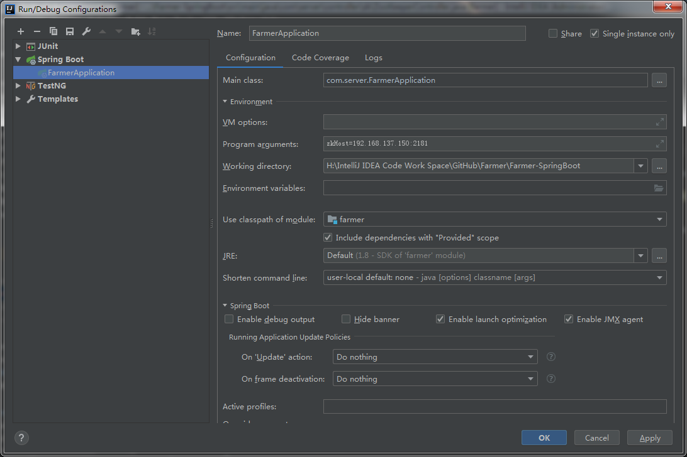
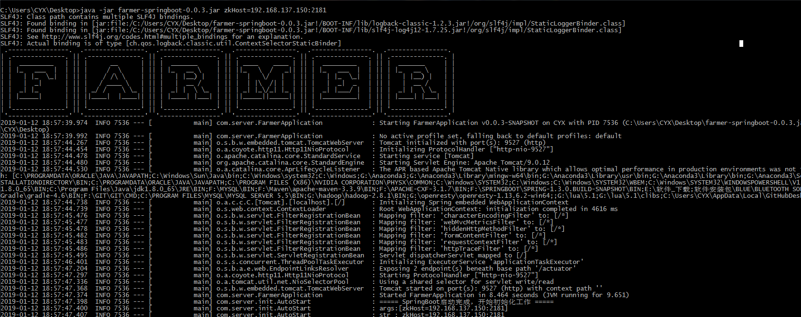
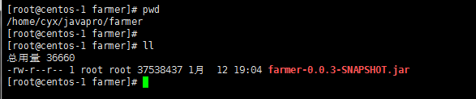
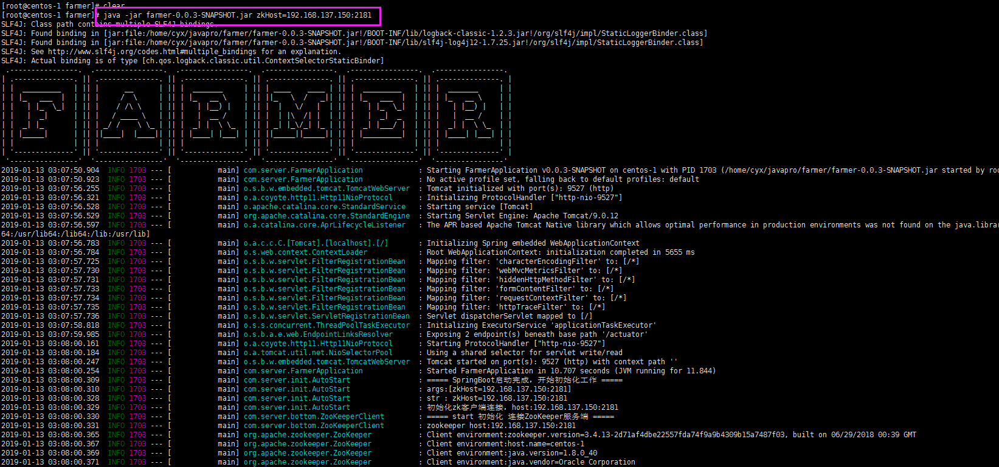

# Farmer如何使用？

## **1.IDEA 编译器启动**

将项目导入IDEA中。

注意：**下图不配置参数，程序也可以启动，点击页面的"连接ZooKeeper服务器"按钮，输入host信息，即可连接ZooKeeper服务器。**

然后根据下图配置ZooKeeper服务器IP，多个IP地址用逗号(',')分隔。

然后启动主类：com.server.FarmerApplication即可

然后访问：http://localhost:9527/zk/index.do

## **2.命令行启动**

### **2.1 Windows系统启动**

从[installPackage目录](https://github.com/Simba-cheng/Farmer/tree/master/Farmer-SpringBoot/installPackage)中下载对应版本的jar包，或者直接在IDEA中通过maven打包获得jar包。

将Farmer的jar包，放在Windows桌面上(根据你的喜好，任意目录中)

然后进入cmd命令行，到jar所在的目录中

执行命令：(ZooKeeper服务器host信息根据实际情况修改)

**java -jar farmer-0.0.3.jar zkHost=192.168.137.150:2181**

 

页面URL : http://localhost:9527/zk/index.do

**注意：上图不配置参数，直接输入"java -jar farmer-0.0.3.jar"，程序也可以启动，点击页面的"连接ZooKeeper服务器"按钮，输入host信息，即可连接ZooKeeper服务器。**

 
 

### **2.2 Linux系统启动**

从[installPackage目录](https://github.com/Simba-cheng/Farmer/tree/master/Farmer-SpringBoot/installPackage)中下载jar包，或者直接在IDEA中通过maven打包获得jar包。

farmer-springboot-0.0.3.jar，将其上传到linux服务器某个目录上。

执行命令：(ZooKeeper服务器host信息根据实际情况修改)

**java -jar farmer-0.0.3-SNAPSHOT.jar zkHost=192.168.137.150:2181**

然后程序即可启动

页面URL : http://localhost:9527/zk/index.do

**注意：上图不配置参数，直接输入"java -jar farmer-0.0.3.jar"，程序也可以启动，点击页面的"连接ZooKeeper服务器"按钮，输入host信息，即可连接ZooKeeper服务器。**

**注意:linux环境下，使用上面这种启动方式，如果xshell tab窗口被关闭，那程序也会终止，如果想在后台运行，则使用这个命令："nohup java -jar farmer-0.0.3-SNAPSHOT.jar zkHost=192.168.137.150:2181 &"。**