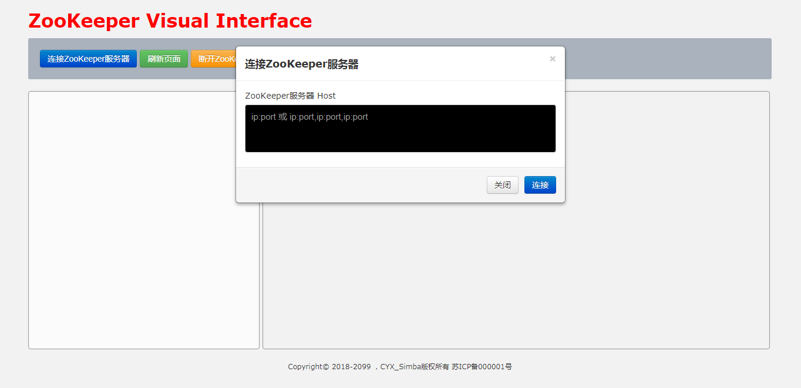
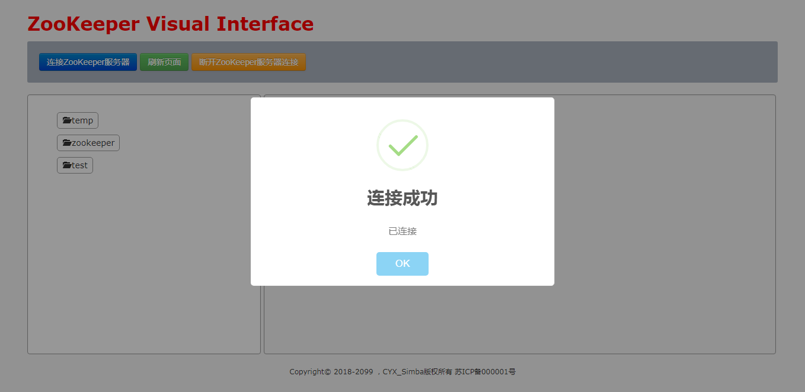
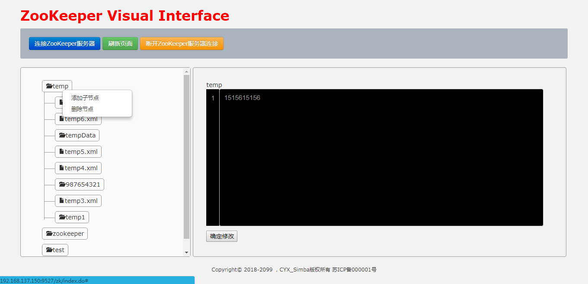
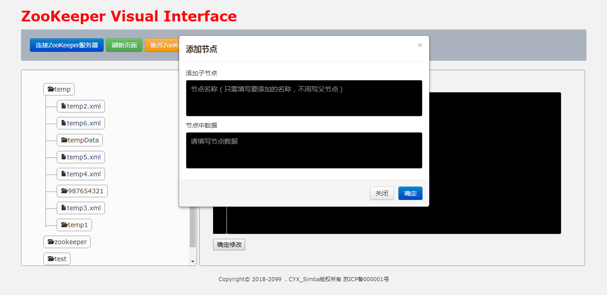
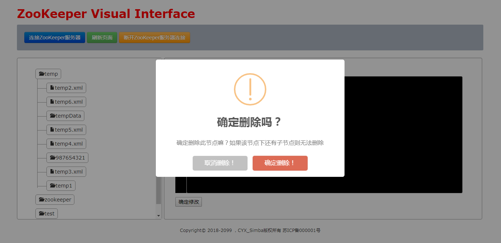

# Farmer - ZooKeeper UI
Farmer是一个ZooKeeper的可视化工具，开箱即用。

## 概览

页面URL : http://localhost:9527/zk/index.do

### **首页展示图**

### **节点、节点数据展示图**

### **页面按钮-连接ZooKeeper服务器**

### **节点右击事件**

### **添加子节点**

### **删除节点**

## 项目简述
**项目定位** : 日常工具、开箱即用。

**用户体验** : 希望最好可以无脑使用

**项目技术** : JDK1.8、Java、SpringBoot 2.X、FreeMarker、JavaScript、jQuery

## 使用说明
从[installPackage目录](https://github.com/Simba-cheng/Farmer/tree/master/Farmer-SpringBoot/installPackage)中下载对应版本的jar包。
jar包的版本号，对应"版本计划"中的功能，高版本涵盖低版本的功能。

## 使用方法

## 版本计划

### 0.0.1(已完成)

    1.命令行启动jar，通过追加'zkClientHost'参数，程序启动既初始化链接ZooKeeper服务器。
    2.命令行带'zkClientHost'参数启动,页面初始化即展示'/'(根节点)下的所有节点
    3.命令行启动jar，无'zkClientHost'参数，不影响程序启动，index页面展示。
    4.命令行无'zkClientHost'参数启动,index页面展示无节点数据。
    5.index页面，点击连接按钮，连接ZooKeeper服务器。
    6.index页面，点击刷新按钮，即可刷新页面。
    7.index页面，点击断开按钮，即断开ZooKeeper服务器连接。
    8.index页面，节点、子节点层级展示,节点与子节点层级动态关联。
    9.index页面，节点、子节点中的数据展示。
    10.index页面，文本展示区域显示行号。
    11.index页面，文本展示区域内容支持修改、保存数据
    12.index页面，后台异常，页面错误信息弹窗提示
    13.index页面，节点数据展示区域支持数据修改、保存。

### 0.0.2 (已完成)

    1.新增子节点
    2.删除节点
    3.交互逻辑优化

### 0.0.3 (已完成)

    1.创建多层节点
    2.数据展示区域-展示节点路径
    3.删除多层节点(递归)
    4.页面用户体验优化

### 0.0.4 (待定)

    1.支持文件上传
    2.支持文件下载

### 0.0.5 (待定)
    1.将改动内容，加入缓存
    2.页面提供历史记录功能
    

## 注意事项：
 
**1.直接download下来的代码可能无法直接打包运行**

    原因：闲暇时间开发，可能会将尚未完成的功能的代码先提交。
    建议：直接使用installPackage目录中的安装包，详情见"使用说明"

**2.用户鉴权**

	Farmer定位是一个日常通用工具，没有增加用户鉴权。
	但随着后续版本迭代，可以成为基于ZooKeeper的配置中心可视化界面。
	所以预留了，用户鉴权接口
