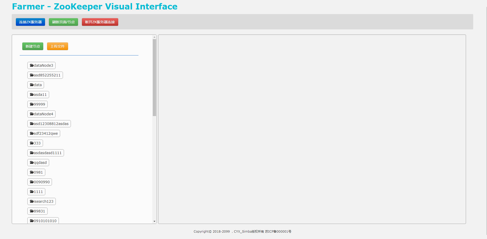
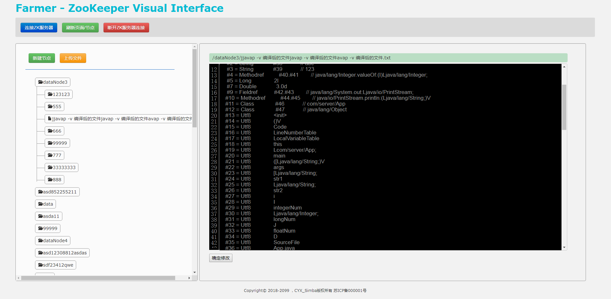
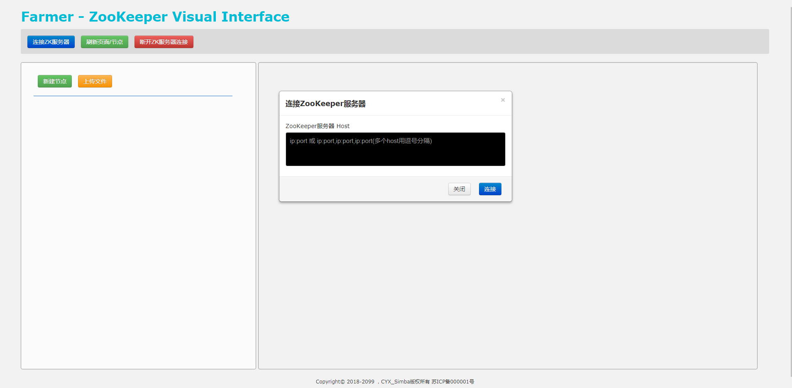
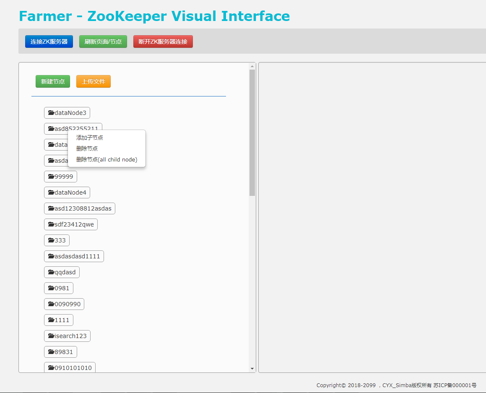

**注意：**

不知道为何图片显示不出来，经过测试，打开"V'P'N" 就可以出图片来。

 

# Farmer - ZooKeeper UI

Farmer 是一个ZooKeeper的可视化工具、Zookeeper配置中心的可视化界面。

很多人都会选择使用ZooKeeper来做系统的配置中心。

以往我们通过zkCli.sh客户端操作ZooKeeper上面的节点，查看、修改ZooKeeper节点中的数据。

每次都要敲不少命令，为了简化操作，做了这样一个工具。

使用Farmer，在页面上即可操作节点、查看节点中的数据。

[Farmer-SpringBoot](https://github.com/Simba-cheng/Farmer/tree/master/Farmer-SpringBoot)

## 项目、工具概览

### **首页展示图**

左侧是层级节点展示区域；右侧是节点信息展示区域

 

### **页面按钮-连接ZooKeeper服务器**

### **节点右击事件**

## 版本
SpringBoot版本使用的是SpringBoot2.X，仅支持JDK1.8以上。

[Farmer-SpringBoot](https://github.com/Simba-cheng/Farmer/tree/master/Farmer-SpringBoot)
