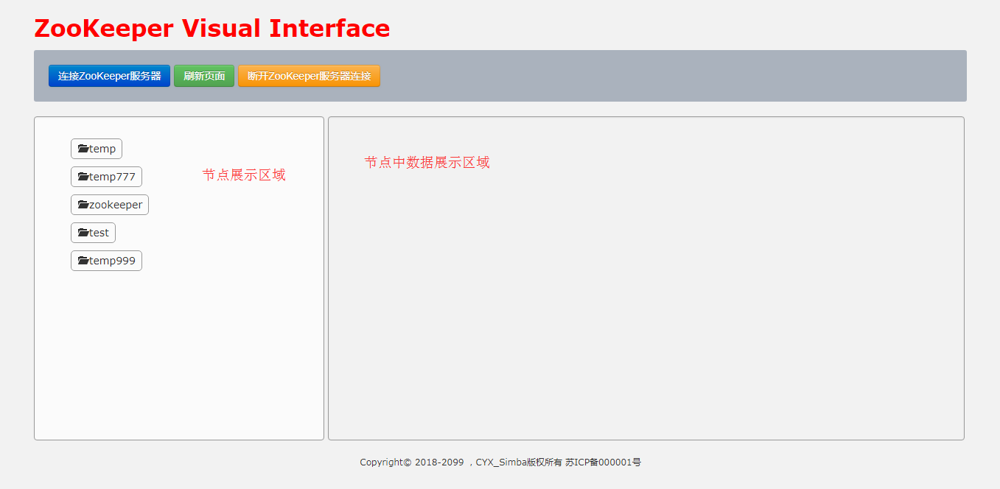
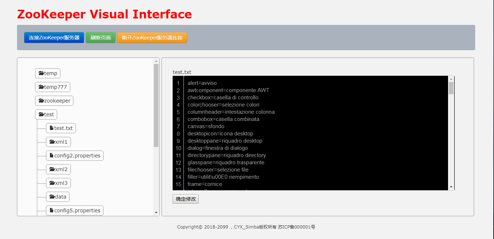

# Farmer - ZooKeeper UI

Farmer 是一个ZooKeeper的可视化工具。

有不少人都会选择使用ZooKeeper来做系统的配置中心。

以往我们通过zkCli.sh客户端操作ZooKeeper上面的节点，查看、修改ZooKeeper节点中的数据。

每次都要敲不少命令，为了简化操作，做了这样一个工具。

使用Farmer，在页面上即可操作节点、查看节点中的数据。

后面会在Farmer的基础上，做一个基于ZooKeeper的配置中心管理工具。

* 为什么要造轮子？

    平日都会保持学习的状态，学习完某个技术、思想后，如果没有实质的产出，时间长了，就会遗忘。 

## 技术版本
Farmer目前分为两个版本：**SpringBoot版本** 和 **SpringMVC版本**

SpringBoot版本使用的是SpringBoot2.X，仅支持JDK1.8以上，为了照顾使用低版本JDK的用户，增加一个SpringMVC版本。

使用SpringMVC版本的用户，就需要使用Tomcat等容器发布使用，没有SpringBoot版本这么方便。

* SpringBoot版本：

    充分利用SpringBoot的优点，不需要容器(Tomcat等)即可使用。 
    具体使用请看：[Farmer-SpringBoot](https://github.com/Simba-cheng/Farmer/tree/master/Farmer-SpringBoot)

* SpringMVC版本：

    待开发，静候。

## 项目、工具概览

* 项目URL : http://localhost:9527/zk/index.do

* **首页展示图** 
 

* **节点、节点数据展示图** 
 
